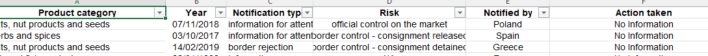
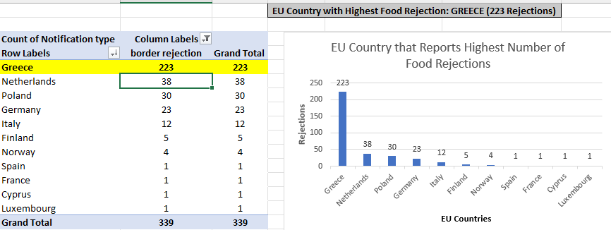
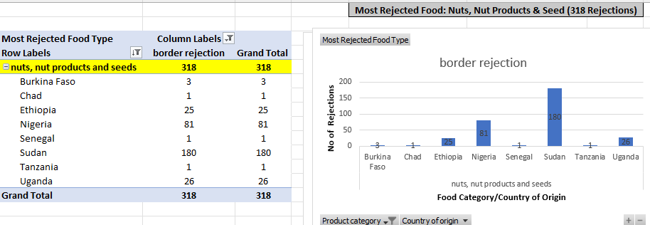
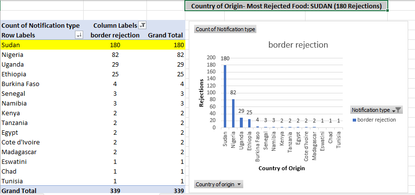
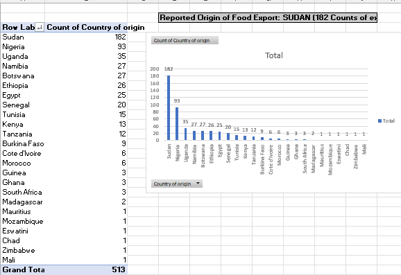

# HiCi-Case-Study

## Introduction
HiCi is a local food company expanding into the European Union (EU), however, there are risks of product rejection and detaining of the consignment as reported by the EU Food Safety Standard Agency. HiCi Ltd needs to overcome various regulatory hurdles to be able to penetrate the EU market. The hurdles are border rejection, and mass destruction of substandard product.

## Problem Statement
Given raw data from the EU Food Safety Standard Agency Portal, we need to derive the following insights:
1.	Identify the EU member country with the highest number of reported food rejections.
2.	Determine the specific food item that experiences the highest rejection rate.
3.	Establish the country of origin for the most frequently rejected food.
4.	Identify the most common action taken against food products exported to the EU.
5.	Pinpoint the primary country of origin for the most reported food exports.

## Skills Demonstrated
The tool employed was Excel, chosen in part due to the dataset's size, which is less than a thousand rows. The demonstrated skills include:
1.	Excel Pivot table
2.	Excel Pivot Chart for visualization 

## Data Cleaning and Analysis
Cleaning of the data was done with the following focus:
1.	Unnecessary Rows & columns removed for aesthetic presentation.
2.	Replace null or blank text column values as follows: Risk (NA); Action Taken (No Information); Distribution Status (Not Available).
3.	Applied Standard Data Quality dimensions to check the following:
a.	Correct values – accuracy
b.	Data fields with values – Completeness 
c.	Consistency
d.	Value up to date – Relevancy
e.	Validity
f.	Uniqueness - Ensuring data are not duplicated.

## Analysis and Visualization
Analysis using the Pivot table & Pivot Chart revealed the following insight.
1.	EU Country with the highest Food Rejection
   
  	
2.	Most Rejected Food
   
  	
3.	Country of origin of most rejected Food
   
4.	Most common action taken against Food exported to EU
	
5.	Most Reported origin of food export

    ## Conclusion
The EU country with the highest number of food rejection is Greece with 223 border rejections.
The most rejected food is in the Product Category: Nuts, Nut products & Seeds with 318 rejects from 8 African countries: Burkina Faso (3); Chad(1), Ethiopia (25), Nigeria(81), 
Senegal(1), Sudan (180), Tanzania (1) & Uganda(26).
The country of origin with most rejected food is Sudan.
The most action taken against food exported to the EU is re-dispatch.
The most reported origin of food export is Sudan.
The Food products at the highest risk are: Nuts, Nut Products & Seeds. The risks are: Consignment detained/ released; Consignment under customs; Food poisoning and Official 
 control on the market.

   ## Recommendation
Management should prioritize food product categories with minimal risks, including soups, broths, sauces, and condiments; confectionery & prepared dishes and snacks. Conversely, the export of Nuts has shown a significant surge since 2017, suggesting growing demand. HiCi should proactively assess and address any risks associated with the export of this food category to enhance revenue opportunities.
 

